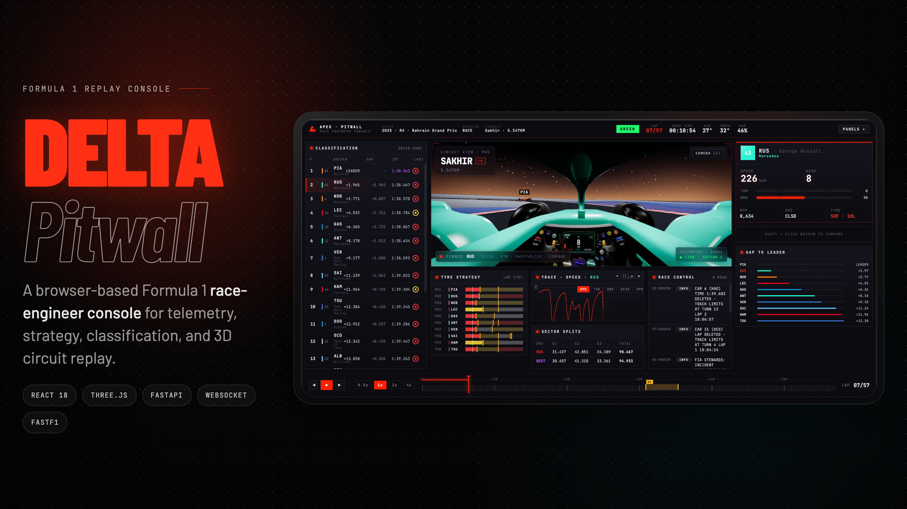
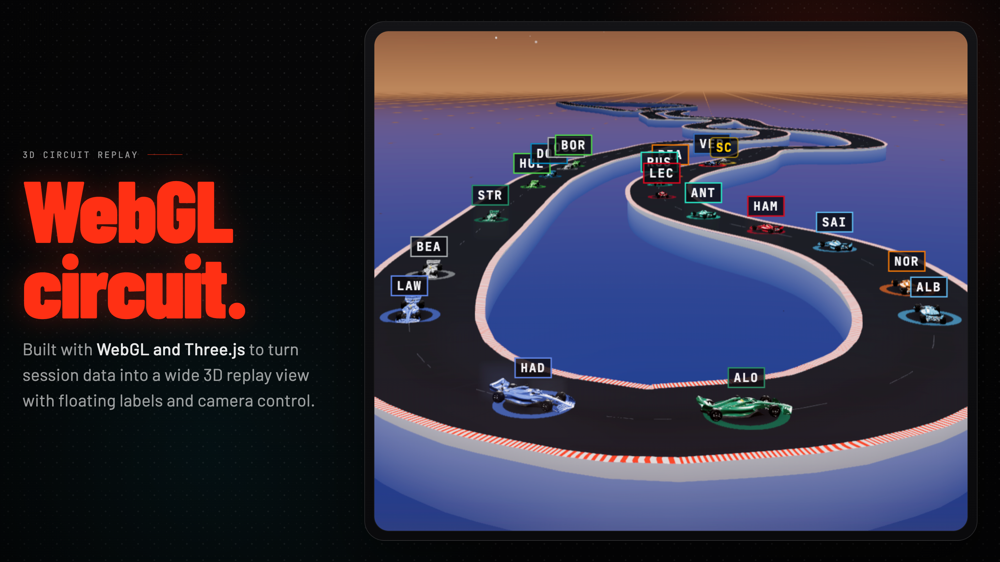
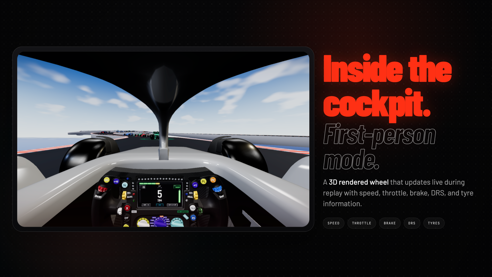
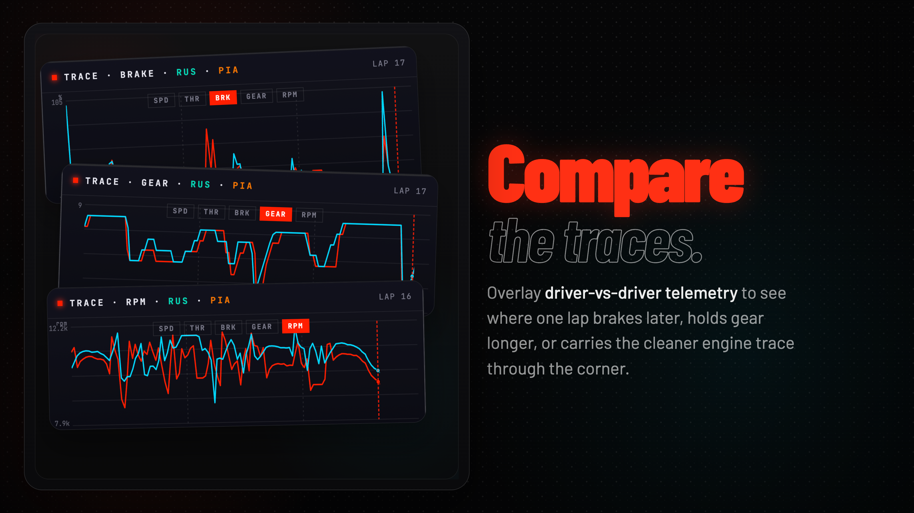
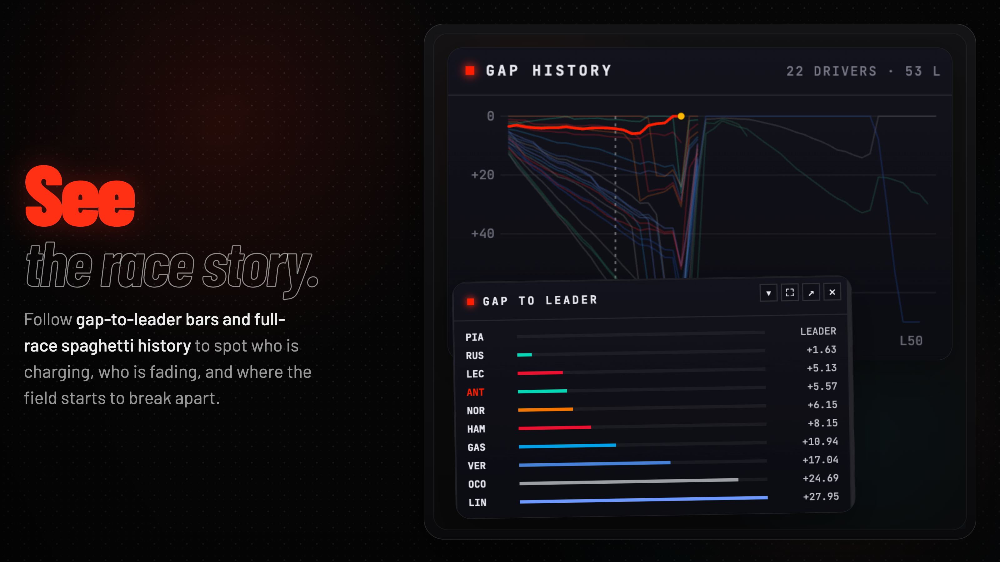
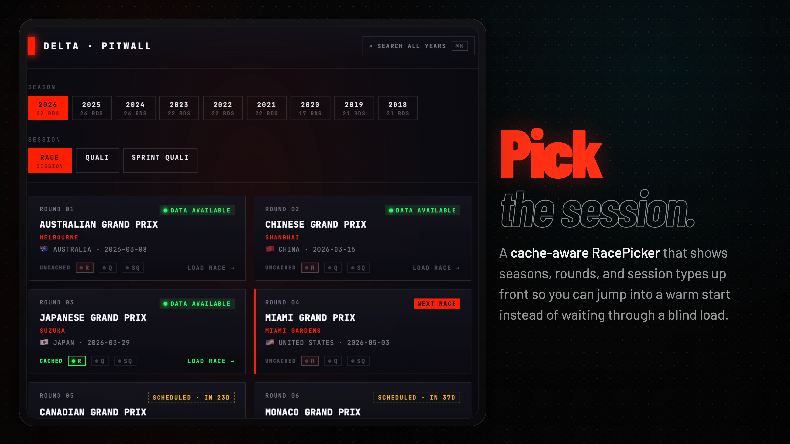
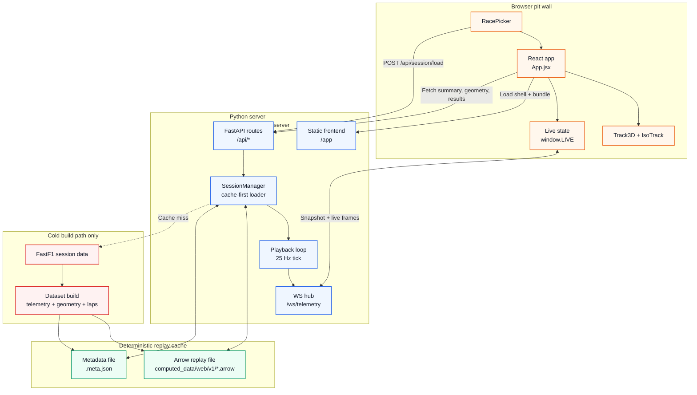
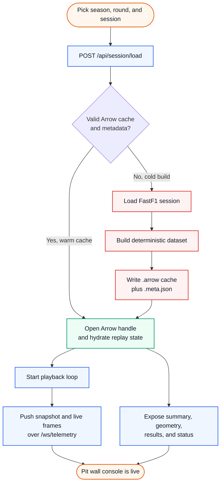

<div align="center">
  

  <p>
    
    
    
    
    
  </p>
  
  <h1>What is it?</h1>

  <p>Delta is a browser-based Formula 1 race engineer console built on FastF1. Load a session, scrub the race, pin drivers, compare telemetry, inspect stint strategy, and flip between wide 3D replay and cockpit POV.</p>

  <p>Built with React, Three.js, FastAPI, and a cache-first Arrow pipeline, so replay data opens fast once a session has been prepared.</p>

   <p>
    <a href="#what-you-get">What You Get</a> •
    <a href="#feature-tour">Feature Tour</a> •
    <a href="#prerequisites">Prerequisites</a> •
    <a href="#quick-start">Quick Start</a> •
    <a href="#panel-map">Panel Map</a> •
    <a href="#technical-notes">Technical Notes</a>
  </p>

</div>

## What You Get

Delta Pitwall turns FastF1 session data into a proper browser pit wall. Load a race, pin a driver, compare another one against them, watch stint strategy unfold, follow the gap story lap by lap, and jump between trackside replay and in-car view without bouncing between tools.

- Ten dockable panels across a three-rail desktop layout
- Timing tower, driver cards, sector status, and lap colouring
- Telemetry overlays for speed, throttle, brake, gear, and RPM
- Stint strategy, gap bars, spaghetti chart, and race-control feed
- Three.js circuit replay with chase, top-down, POV, and IsoTrack views
- Warm-cache loading through `RacePicker` and deterministic Arrow snapshots

## Feature Tour

### Full Pit Wall Layout

- Ten dockable panels arranged across a three-rail desktop layout
- Panels can collapse, maximize, hide, and pop out into their own window
- Layout and view preferences persist in `localStorage`

### 3D Circuit Replay

- Three.js circuit scene with weather-aware styling and GLB car and safety-car models
- Orbit, chase, POV, top-down, and legacy IsoTrack views
- Floating labels, selection highlights, safety-car overlays, and an optional mini-map



### Driver POV

- First-person mode from the pinned driver's car
- Live steering-wheel HUD with speed, gear, throttle, brake, DRS, tyre, lap, and flag information
- Includes a tuning panel for HUD placement and emissive settings when you want to dial the look in



### Timing and Driver Focus

- Engineering-style timing tower with sector status, gaps, intervals, and lap colouring
- Primary and compare driver cards with speed, gear, throttle, brake, RPM, DRS, and tyre state
- Click a driver to pin them, `Shift + Click` to compare against a second driver

### Telemetry Compare

- Lap overlays for speed, throttle, brake, gear, and RPM
- Live playhead synced to replay progress
- Sector times panel for quick split comparison
- Useful for showing where one driver gains, brakes later, or gets traction down earlier



### Strategy, Gaps, and Race Story

- Stint bars for the top 10 with compound colouring, pit-stop ticks, and current-lap marker
- Gap-to-leader bars for a fast read of race spread
- Gap-history spaghetti chart for the full race story over time
- Race-control feed layered into the same console for flags, safety car, DRS, and other key events



### Replay Control and RacePicker

- Play, pause, seek, speed controls, and live timeline scrubbing
- Top bar with flag state, lap counter, race clock, air temperature, track temperature, and humidity
- Timeline overlays for laps, sectors, and safety-car periods
- Hotkeys for fast replay control and camera switching
- Built-in `RacePicker` flow for season, round, and session selection
- Cached races are surfaced quickly through the web-cache index
- Warm-cache loads reuse computed replay data instead of rebuilding it



## Prerequisites

Install these before your first run:

- [Python 3.9+](https://www.python.org/downloads/)
- [Node.js 18+](https://nodejs.org/en/download/)

## Quick Start

> First run only. Use one script and let it handle the setup. Check Technical Notes for manual setup.

**macOS / Linux**

```bash
bash scripts/start.sh
```

**Windows PowerShell**

```powershell
.\scripts\start.ps1
```

**Windows Command Prompt**

```bat
scripts\start.bat
```

When the server is ready, it prints the local URL in the terminal.

After the first run, skip setup and start the server directly:

**macOS / Linux**

```bash
source .venv/bin/activate
python -m src.web.pit_wall_server
```

**Windows PowerShell**

```powershell
.\.venv\Scripts\Activate.ps1
python -m src.web.pit_wall_server
```

**Windows Command Prompt**

```bat
.venv\Scripts\activate.bat
python -m src.web.pit_wall_server
```

## Panel Map

| Panel | What it shows |
|---|---|
| `CLASSIFICATION` | Live race order, gaps, intervals, sector state, and lap colouring |
| `CIRCUIT VIEW` | 3D track replay, chase/POV/top modes, labels, and overlays |
| `STRATEGY` | Tyre stints, pit windows, and lap marker |
| `COMPARE TRACES` | Speed, throttle, brake, gear, and RPM overlays |
| `SECTOR TIMES` | Split-by-split comparison for selected drivers |
| `RACE CONTROL` | Time-filtered race-control messages |
| `PRIMARY DRIVER` | Detailed telemetry card for the pinned driver |
| `COMPARE DRIVER` | Side-by-side telemetry card for the comparison driver |
| `GAP VISUALIZATION` | Live gap-to-leader bars |
| `GAP HISTORY` | Race-long spaghetti chart with pit markers and status overlays |

## Technical Notes

<details>
<summary>Manual setup</summary>

If you want to do the first-time setup step by step:

```bash
# 1. Create and activate a virtual environment
python3 -m venv .venv
source .venv/bin/activate        # macOS / Linux
# .venv\Scripts\Activate.ps1    # Windows PowerShell
# .venv\Scripts\activate.bat    # Windows CMD

# 2. Install Python dependencies
pip install -r requirements.txt

# 3. Install and build the frontend
cd project
npm install
npm run build
cd ..

# 4. Start the server
python -m src.web.pit_wall_server
```

</details>

<details>
<summary>CLI flags</summary>

| Flag | Default | Description |
|---|---|---|
| `--year` | unset | Championship year |
| `--round` | unset | Round number |
| `--session-type` | `R` | Session code such as `R`, `Q`, or `SQ` |
| `--host` | `127.0.0.1` | Bind address |
| `--port` | `8000` | Bind port |
| `--cache-dir` | `cache/fastf1` | FastF1 HTTP cache directory |

Example:

```bash
python -m src.web.pit_wall_server --year 2025 --round 12 --session-type R
```

If you omit `--year` and `--round`, the app opens into `RacePicker`.

</details>

<details>
<summary>Development and hotkeys</summary>

Frontend watch mode:

```bash
cd project
npm run watch
```

Backend and pipeline tests:

```bash
python -m pytest tests
```

Frontend tests:

```bash
cd project
npm test
```

Useful hotkeys:

| Key | Action |
|---|---|
| `Space` | Play / pause |
| `Left` / `Right` | Seek backward / forward |
| `Up` / `Down` | Increase / decrease playback speed |
| `1` `2` `3` `4` | Set `0.5x`, `1x`, `2x`, `4x` |
| `D` | Return to default WebGL view |
| `F` | Toggle chase view |
| `M` | Toggle top-down view |
| `L` | Toggle labels |
| `C` | Toggle camera controls |
| `H` | Toggle POV HUD |
| `N` | Toggle mini-map |
| `R` | Restart replay from the beginning |

</details>

<details>
<summary>Architecture and session lifecycle</summary>



`SessionManager.load(year, round, session_type)` follows a warm-cache path when replay data already exists and a rebuild path only when the cache is missing or stale.



1. Warm cache: validate `computed_data/web/v1/*.arrow` plus `.meta.json`, open the Arrow handle, and hydrate runtime state directly.
2. Cold build: load the FastF1 session, build the deterministic dataset, write Arrow + metadata, then reopen from cache.

</details>

<details>
<summary>API summary</summary>

### REST endpoints

| Method | Path | Purpose |
|---|---|---|
| `GET` | `/api/seasons` | Available seasons and round counts |
| `GET` | `/api/seasons/{year}/rounds` | Round list for RacePicker |
| `GET` | `/api/web_cache/index` | Cache badge data for RacePicker |
| `POST` | `/api/session/load` | Begin non-blocking session load |
| `GET` | `/api/session/status` | Loading state, message, and progress |
| `GET` | `/api/session/summary` | Event, drivers, laps, rotation |
| `GET` | `/api/session/geometry` | Public track geometry payload |
| `GET` | `/api/session/race_control` | Race-control messages |
| `GET` | `/api/session/results` | Final-ish classification view |
| `GET` | `/api/session/gap_to_leader` | Gap-history chart data |
| `GET` | `/api/session/lap_telemetry/{code}/{lap}` | Lap trace data for compare panels |
| `POST` | `/api/playback/play` | Resume playback |
| `POST` | `/api/playback/pause` | Pause playback |
| `POST` | `/api/playback/seek` | Seek by normalized race fraction |
| `POST` | `/api/playback/speed` | Set playback speed |

### WebSocket

| Path | Purpose |
|---|---|
| `/ws/telemetry` | Snapshot on connect, then live replay frame updates |

</details>

<details>
<summary>Project layout and notes</summary>

```text
.
|- assets/
|  `- models/                 # Source GLB models tracked in git
|- project/
|  |- Pit Wall.html           # Static shell served at /app/
|  |- build.mjs               # esbuild bundler + asset copy
|  |- src/                    # React app and Three.js view code
|  `- tests/                  # Frontend tests
|- src/
|  |- data/                   # Arrow cache and storage helpers
|  |- lib/                    # Shared utility code
|  |- web/                    # FastAPI app, playback, routes, WS hub
|  `- f1_data.py              # FastF1 session loading and dataset building
|- tests/                     # Backend and pipeline tests
|- computed_data/             # Runtime-generated replay caches
`- README.md
```

- `project/assets/` is generated by the frontend build and intentionally ignored.
- `project/dist/` is generated output and intentionally ignored.
- Cached replay data under `computed_data/` and HTTP cache data under `cache/` are runtime artifacts, not source.
- To force a web cache rebuild, remove the relevant Arrow files or set `DELTA_FORCE_WEB_CACHE_REBUILD=1` when starting the server.

</details>

## Asset Credits

Source code in this repository is MIT-licensed. Third-party 3D assets are licensed separately:

- `F1 2022 Generic` by [TheoDevF1](https://sketchfab.com/TheoDevF12), used under [CC BY-NC-ND 4.0](https://creativecommons.org/licenses/by-nc-nd/4.0/). Source: [sketchfab.com](https://sketchfab.com/3d-models/f1-2022-generic-9b2fc584679e468ca3a7cb98a75857d2)
- `2019 Mercedes-Benz AMG GTR Safety Car` by [OUTPISTON](https://sketchfab.com/outpiston), used under [CC BY-NC-SA 4.0](https://creativecommons.org/licenses/by-nc-sa/4.0/). Source: [sketchfab.com](https://sketchfab.com/3d-models/2019-mercedes-benz-amg-gtr-safety-car-5bfaf6b31d084dde80dae723b52998bc)

## Attribution

This project builds on [Tom Shaw's f1-race-replay](https://github.com/IAmTomShaw/f1-race-replay). The current version extends it with a browser-based pit wall console, a deterministic Arrow cache pipeline, and a 3D WebGL replay experience.
