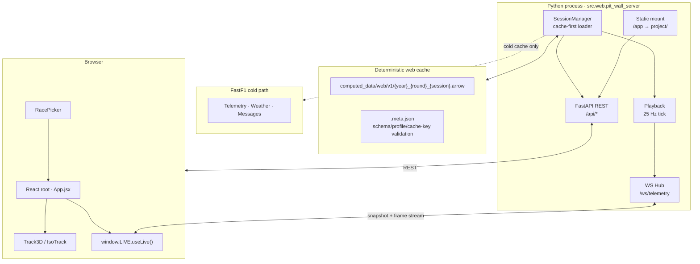

<div align="center">

# APEX · Pit Wall

**A browser-based Formula 1 race-engineer console**  
React 18 · Three.js · FastAPI · WebSocket · FastF1

*A 10-panel dockable HUD for telemetry, strategy, classification, and 3D circuit replay — backed by a deterministic Arrow cache pipeline.*

</div>


## What It Is

APEX Pit Wall is a browser replay console for Formula 1 race data. It combines:

- a **React** frontend served from `project/`
- a **FastAPI + Uvicorn** backend in `src/web/`
- a **cache-first FastF1 pipeline** that writes deterministic Arrow snapshots under `computed_data/web/v1/`

The desktop runtime from the original fork lineage has been removed from this repository, so this codebase now keeps only what the browser stack needs.

## Highlights

| Area | What you get |
|---|---|
| **Console** | 10 dockable panels with collapse, maximize, hide, and pop-out behaviour |
| **Rendering** | Three.js track scene with GLB car models, weather-aware styling, and quality presets |
| **Views** | WebGL orbit, chase, POV, top-down, and legacy-style IsoTrack modes |
| **Telemetry** | Live classification, lap telemetry lookups, compare traces, and track-status overlays |
| **Strategy** | Stint bars, pit markers, gap-to-leader visualization, and gap-history charting |
| **Replay** | Server-authoritative playback with play, pause, seek, and speed controls |
| **Cache** | Warm-start Arrow cache reuse with schema validation and deterministic rebuilds |
| **Picker** | RacePicker flow for season, round, and session selection without CLI setup |

## Quick Start

### macOS / Linux

```bash
# 1. Create and activate a virtual environment
python3 -m venv .venv
source .venv/bin/activate

# 2. Install Python dependencies
pip install -r requirements.txt

# 3. Build the frontend bundle
cd project
npm install
npm run build
cd ..

# 4. Start the server
python -m src.web.pit_wall_server
```

### Windows

```bash
python -m venv .venv
.venv\\Scripts\\activate
pip install -r requirements.txt
cd project
npm install
npm run build
cd ..
python -m src.web.pit_wall_server
```

Open:

```text
http://localhost:8000/app/Pit%20Wall.html
```

If you start the server without `--year` and `--round`, the app opens into **RacePicker**.  
If you already know the session you want:

```bash
python -m src.web.pit_wall_server --year 2025 --round 12 --session-type R
```

### CLI flags

| Flag | Default | Description |
|---|---|---|
| `--year` | unset | Championship year |
| `--round` | unset | Round number |
| `--session-type` | `R` | Session code such as `R`, `Q`, or `SQ` |
| `--host` | `127.0.0.1` | Bind address |
| `--port` | `8000` | Bind port |
| `--cache-dir` | `cache/fastf1` | FastF1 HTTP cache directory |

## Development

### Frontend dev loop

```bash
cd project
npm run watch
```

The bundle is written to `project/dist/bundle.js`. React and ReactDOM are loaded as CDN globals by `project/Pit Wall.html`, while the application code is bundled by esbuild.

`npm install` does not use the Python virtual environment. It is fine to run it in the same terminal while the venv is active, because Node and npm are separate from Python. You only need to make sure you are in the `project/` directory when running the npm commands.

### Tests

Backend / pipeline tests:

```bash
python -m pytest tests
```

Frontend hotkey tests:

```bash
cd project
npm test
```

## Architecture



### Cache-first session lifecycle

`SessionManager.load(year, round, session_type)` takes one of two paths:

1. **Warm cache**: validate `computed_data/web/v1/*.arrow` plus `.meta.json`, open the Arrow handle, and hydrate runtime state directly.
2. **Cold build**: load the FastF1 session, build the deterministic dataset, write Arrow + metadata, then reopen from cache.

That gives the UI a predictable loading flow:

`Checking web cache` → `Building web cache` → `Hydrating replay state` → `Ready`

## UI Overview

The console is built around a three-rail layout:

- **Left rail**: classification and session context
- **Center**: circuit view, timeline, transport, and camera controls
- **Right rail**: driver detail, gap panels, compare views, and strategy context

Notable UI capabilities:

- 10 panels managed through `project/src/PanelFrame.jsx`
- pop-out panel windows and fullscreen panel mode
- WebGL **CHASE** and **POV** cameras alongside orbit, top-down, and IsoTrack
- persisted view state and panel preferences via `localStorage`
- top-bar weather/session metadata and timeline overlays for SC/VSC/red periods

## API Summary

### REST endpoints

| Method | Path | Purpose |
|---|---|---|
| `GET` | `/api/seasons` | Available seasons |
| `GET` | `/api/seasons/{year}/rounds` | Round list for RacePicker |
| `GET` | `/api/web_cache/index` | Cache badge data for RacePicker |
| `POST` | `/api/session/load` | Begin non-blocking session load |
| `GET` | `/api/session/status` | Loading state |
| `GET` | `/api/session/summary` | Event, drivers, laps, rotation |
| `GET` | `/api/session/geometry` | Public track geometry payload |
| `GET` | `/api/session/race_control` | Race control messages |
| `GET` | `/api/session/results` | Final-ish classification view |
| `GET` | `/api/session/gap_to_leader` | Gap-history chart data |
| `GET` | `/api/session/lap_telemetry/{code}/{lap}` | Lap trace data for compare panels |
| `POST` | `/api/playback/play` | Resume playback |
| `POST` | `/api/playback/pause` | Pause playback |
| `POST` | `/api/playback/seek` | Seek by normalized race fraction |
| `POST` | `/api/playback/speed` | Set playback speed |

### WebSocket

| Path | Purpose |
|---|---|
| `/ws/telemetry` | Snapshot on connect, then live replay frame updates |

## Asset Credits

Source code in this repository is MIT-licensed. Third-party 3D assets are licensed separately:

- `F1 2022 Generic` by [TheoDevF1](https://sketchfab.com/TheoDevF12), used under [CC BY-NC-ND 4.0](https://creativecommons.org/licenses/by-nc-nd/4.0/). Source: https://sketchfab.com/3d-models/f1-2022-generic-9b2fc584679e468ca3a7cb98a75857d2
- `2019 Mercedes-Benz AMG GTR Safety Car` by [OUTPISTON](https://sketchfab.com/outpiston), used under [CC BY-NC-SA 4.0](https://creativecommons.org/licenses/by-nc-sa/4.0/). Source: https://sketchfab.com/3d-models/2019-mercedes-benz-amg-gtr-safety-car-5bfaf6b31d084dde80dae723b52998bc

## Project Layout

```text
.
├── assets/
│   └── models/                 # Source GLB models tracked in git
├── project/
│   ├── Pit Wall.html           # Static shell served at /app/
│   ├── build.mjs               # esbuild bundler + asset copy
│   ├── src/                    # React app and Three.js view code
│   └── tests/                  # Frontend tests
├── src/
│   ├── data/                   # Arrow cache and storage helpers
│   ├── lib/                    # Shared utility code
│   ├── web/                    # FastAPI app, playback, routes, WS hub
│   └── f1_data.py              # FastF1 session loading and dataset building
├── tests/                      # Backend and pipeline tests
├── requirements.txt
└── computed_data/              # Runtime-generated replay caches
```

## Notes

- `project/assets/` is generated by the frontend build and intentionally ignored.
- `project/dist/` is generated output and intentionally ignored.
- Cached replay data under `computed_data/` and HTTP cache data under `cache/` are runtime artifacts, not source.
- To force a web cache rebuild, remove the relevant Arrow files or set `APEX_FORCE_WEB_CACHE_REBUILD=1` when starting the server.

## Attribution

This standalone repository builds on the original FastF1 replay work from the upstream `f1-race-replay` lineage. The current version is focused specifically on the web console, cache pipeline, and 3D replay experience.
